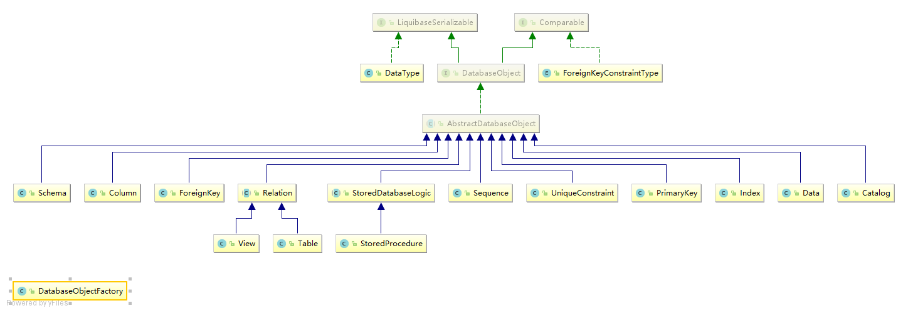
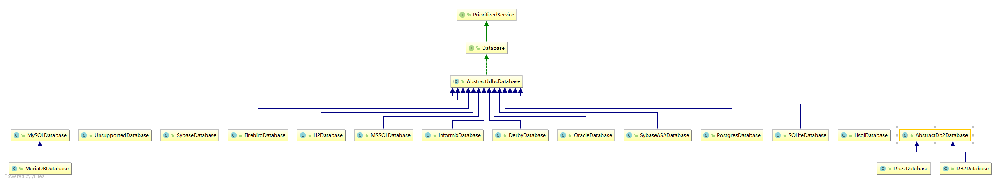

# Liquibase Spring示例

## 概述

在SpringBoot项目中使用LiquiBase，分析数据库版本差异。根据差异维护数据库结构。

- 使用Liquibase初始化数据库: LiquiApplication.java（参考: https://javadeveloperzone.com/spring-boot/spring-boot-liquibase-example/)
- 使用Liquibase区分数据库差异: LiquiDiff.java

## 概念

- 数据库对象：

- 支持的数据库:

## 运行环境

- JDK8+
- Gradle
- SpringBoot
- Liquibase
- H2
    

## 1. 使用Liquibase初始化数据库

### 1.1 功能: 
- 使用Liquibase的描述文件(XML, JSON, YML)来创建数据库可以使用相同的描述文件在不同的数据库上创建数据库。
- Liquibase能够加载、使用、生成这些结构化的配置文件。
### 1.2 步骤: 
- 创建SpringBoot的Web项目并添加依赖项: h2, liquibase-core, springboot-starter-jdbc
- 配置Applications.properties
    ~~~Properties
    spring.datasource.driver-class-name=org.h2.Driver
    spring.datasource.url=jdbc:h2:./test;
    spring.datasource.username=sa
    spring.datasource.password=sa
    spring.h2.console.enabled=true
    
    logging.level.liquibase=INFO
    
    spring.liquibase.change-log=classpath:/changelog-master.xml
    ~~~
- 编写Liquibase的数据库创建xml脚本
    - 主文件: changelog-master.xml, 包含若干具体任务的脚本。
    - 建表: create-person-table-changelog-1.xml, 在给定的数据库创建表。
    - 插数据: insert-person-table-changelog-2.xml, 
    - 更新数据: update-person-table-precondition-3.xml
- 编写SpringBoot的启动代码： LiquiApplication.java。
- 启动项目会发现日志输出增加了建表、插数据、更新数据的语句。
- 访问http://localhost:8080/h2-console访问数据库(修改JDBC URL为: jdbc:h2:./test)会发现该数据库中已经存在PERSON表，其中包含一条数据。

## 2 使用Liquibase对比数据库

### 2.1 功能

对比两个数据库以文本或XML的形式输出结构上的差异。例如: 

- 创建SpringBoot的命令行启动程序: LiquiDiff.java
- 编写功能函数: diffCommand();
    - 建立两个不同的数据库连接，一个是被之前web项目初始化过的，一个没有进行过任何操作的内存库
        ~~~Java
        Connection connection1 = DriverManager.getConnection("jdbc:h2:./test", "sa", "sa");
        Connection connection2 = DriverManager.getConnection("jdbc:h2:mem:test");
        ~~~
  
    - 封装为Liquibase可接受的连接对象
        ~~~Java
        DatabaseConnection databaseConnection1 = new JdbcConnection(connection1);
        DatabaseConnection databaseConnection2 = new JdbcConnection(connection2);
        ~~~
  
    - 封装为Liquibase可对比用的数据库对象
        ~~~Java
        H2Database h2Database1 = new H2Database();
        h2Database1.setConnection(databaseConnection1);
        H2Database h2Database2 = new H2Database();
        h2Database2.setConnection(databaseConnection2);
        ~~~
  
    - 进行对比
        ~~~Java
        diffCommand.setReferenceDatabase(h2Database1)           //设定参照数据库
              .setTargetDatabase(h2Database2)                 //设定目标数据库
              .setOutputStream(System.out)                    //输出到控制台
              .setCompareControl(CompareControl.STANDARD)     //以标准方式对比
              .execute();   
        ~~~
    - 输出结果
        ~~~TXT
        Reference Database: SA @ jdbc:h2:./test (Default Schema: PUBLIC)
        Comparison Database:  @ jdbc:h2:mem:test (Default Schema: PUBLIC)
        Compared Schemas: PUBLIC
        Product Name: EQUAL
        Product Version: EQUAL
        Missing Catalog(s): NONE
        Unexpected Catalog(s): NONE
        Changed Catalog(s): NONE
        Missing Column(s): 
             PUBLIC.PERSON.ADDRESS
             PUBLIC.DATABASECHANGELOG.AUTHOR
             PUBLIC.DATABASECHANGELOG.COMMENTS
             PUBLIC.DATABASECHANGELOG.CONTEXTS
             PUBLIC.DATABASECHANGELOG.DATEEXECUTED
             PUBLIC.DATABASECHANGELOG.DEPLOYMENT_ID
             PUBLIC.DATABASECHANGELOG.DESCRIPTION
             PUBLIC.DATABASECHANGELOG.EXECTYPE
             PUBLIC.DATABASECHANGELOG.FILENAME
             PUBLIC.DATABASECHANGELOG.ID
             PUBLIC.DATABASECHANGELOGLOCK.ID
             PUBLIC.PERSON.ID
             PUBLIC.DATABASECHANGELOG.LABELS
             PUBLIC.DATABASECHANGELOG.LIQUIBASE
             PUBLIC.DATABASECHANGELOGLOCK.LOCKED
             PUBLIC.DATABASECHANGELOGLOCK.LOCKEDBY
             PUBLIC.DATABASECHANGELOGLOCK.LOCKGRANTED
             PUBLIC.DATABASECHANGELOG.MD5SUM
             PUBLIC.PERSON.NAME
             PUBLIC.DATABASECHANGELOG.ORDEREXECUTED
             PUBLIC.DATABASECHANGELOG.TAG
        Unexpected Column(s): NONE
        Changed Column(s): NONE
        Missing Foreign Key(s): NONE
        Unexpected Foreign Key(s): NONE
        Changed Foreign Key(s): NONE
        Missing Index(s): 
             PRIMARY_KEY_8 UNIQUE  ON PUBLIC.PERSON(ID)
             PRIMARY_KEY_D UNIQUE  ON PUBLIC.DATABASECHANGELOGLOCK(ID)
        Unexpected Index(s): NONE
        Changed Index(s): NONE
        Missing Primary Key(s): 
             PK_DATABASECHANGELOGLOCK on PUBLIC.DATABASECHANGELOGLOCK(ID)
             PK_PERSON on PUBLIC.PERSON(ID)
        Unexpected Primary Key(s): NONE
        Changed Primary Key(s): NONE
        Missing Schema(s): NONE
        Unexpected Schema(s): NONE
        Changed Schema(s): NONE
        Missing Sequence(s): NONE
        Unexpected Sequence(s): NONE
        Changed Sequence(s): NONE
        Missing Stored Procedure(s): NONE
        Unexpected Stored Procedure(s): NONE
        Changed Stored Procedure(s): NONE
        Missing Table(s): 
             DATABASECHANGELOG
             DATABASECHANGELOGLOCK
             PERSON
        Unexpected Table(s): NONE
        Changed Table(s): NONE
        Missing Unique Constraint(s): NONE
        Unexpected Unique Constraint(s): NONE
        Changed Unique Constraint(s): NONE
        Missing View(s): NONE
        Unexpected View(s): NONE
        Changed View(s): NONE
        ~~~
        
## 3. 使用Liquibase建立数据库快照

### 3.1 功能
通过扫描数据库，将数据库的元数据状态持久化并保存。可以输出txt, json, xml, yml四种形式。

### 3.2 调用

- 初始化参数
    ~~~Java
    System.setProperty("logging.level.liquibase", "INFO");
    
    //建立数据库连接
    Connection connection1 = DriverManager.getConnection("jdbc:h2:./test", "sa", "sa");
    
    //封装为Liquibase可接受的连接对象
    DatabaseConnection databaseConnection1 = new JdbcConnection(connection1);
    
    //封装为Liquibase可对比用的数据库对象
    H2Database h2Database1 = new H2Database();
    h2Database1.setConnection(databaseConnection1);
    ~~~
- 调用方式1: 通过Command接口调用
    ~~~Java
    //通过SnapshotCommand接口调用
    SnapshotCommand snapshotCommand = new SnapshotCommand();
    snapshotCommand.setDatabase(h2Database1);
    SnapshotCommand.SnapshotCommandResult snapshotCommandResult = snapshotCommand.execute();
    System.out.println(snapshotCommandResult.print());
    ~~~

- 调用方式2: 通过Snapshot调用，参考SnapshotCommand内部代码。
    ~~~Java
    //通过SnapshotGeneratorFactory和SnapshotController调用
    SnapshotControl snapshotControl = new SnapshotControl(h2Database1);
    CatalogAndSchema[] schemas = schemas = new CatalogAndSchema[]{h2Database1.getDefaultSchema()};
    ObjectQuotingStrategy originalQuotingStrategy = h2Database1.getObjectQuotingStrategy();
    h2Database1.setObjectQuotingStrategy(ObjectQuotingStrategy.QUOTE_ALL_OBJECTS);
    DatabaseSnapshot snapshot = SnapshotGeneratorFactory.getInstance().createSnapshot(schemas, h2Database1, snapshotControl);
    String string = SnapshotSerializerFactory.getInstance().getSerializer("txt").serialize(snapshot, true);
    System.out.println(string);
    ~~~

### 3.3 输出结果

输出结果支持json, yml, txt三种形式。

~~~JSON
{
  "snapshot": {
    "created": "2019-04-25T17:12:01.654",
    "database": {
      "productVersion": "1.2.131 (2010-03-05)",
      "shortName": "h2",
      "majorVersion": "1",
      "minorVersion": "2",
      "user": "SA",
      "productName": "H2",
      "url": "jdbc:h2:./test"
    },
    "objects": {
      "liquibase.structure.core.Catalog": [
        {
          "catalog": {
            "default": true,
            "name": "TEST",
            "snapshotId": "1555100"
          }
        }]
      ,
      "liquibase.structure.core.Column": [
        {
          "column": {
            "name": "ADDRESS",
            "nullable": true,
            "order": "3!{java.lang.Integer}",
            "relation": "liquibase.structure.core.Table#1555102",
            "snapshotId": "1555106",
            "type": {
              "characterOctetLength": "255!{java.lang.Integer}",
              "columnSize": "255!{java.lang.Integer}",
              "columnSizeUnit": "BYTE!{liquibase.structure.core.DataType$ColumnSizeUnit}",
              "dataTypeId": "12!{java.lang.Integer}",
              "radix": "10!{java.lang.Integer}",
              "typeName": "VARCHAR"
            }
          }
        },
        {
          "column": {
            "name": "AUTHOR",
            "nullable": false,
            "order": "2!{java.lang.Integer}",
            "relation": "liquibase.structure.core.Table#1555108",
            "snapshotId": "1555110",
            "type": {
              "characterOctetLength": "255!{java.lang.Integer}",
              "columnSize": "255!{java.lang.Integer}",
              "columnSizeUnit": "BYTE!{liquibase.structure.core.DataType$ColumnSizeUnit}",
              "dataTypeId": "12!{java.lang.Integer}",
              "radix": "10!{java.lang.Integer}",
              "typeName": "VARCHAR"
            }
          }
        },
        {
          "column": {
            "name": "COMMENTS",
            "nullable": true,
            "order": "9!{java.lang.Integer}",
            "relation": "liquibase.structure.core.Table#1555108",
            "snapshotId": "1555117",
            "type": {
              "characterOctetLength": "255!{java.lang.Integer}",
              "columnSize": "255!{java.lang.Integer}",
              "columnSizeUnit": "BYTE!{liquibase.structure.core.DataType$ColumnSizeUnit}",
              "dataTypeId": "12!{java.lang.Integer}",
              "radix": "10!{java.lang.Integer}",
              "typeName": "VARCHAR"
            }
          }
        },
        {
          "column": {
            "name": "CONTEXTS",
            "nullable": true,
            "order": "12!{java.lang.Integer}",
            "relation": "liquibase.structure.core.Table#1555108",
            "snapshotId": "1555120",
            "type": {
              "characterOctetLength": "255!{java.lang.Integer}",
              "columnSize": "255!{java.lang.Integer}",
              "columnSizeUnit": "BYTE!{liquibase.structure.core.DataType$ColumnSizeUnit}",
              "dataTypeId": "12!{java.lang.Integer}",
              "radix": "10!{java.lang.Integer}",
              "typeName": "VARCHAR"
            }
          }
        },
        {
          "column": {
            "name": "DATEEXECUTED",
            "nullable": false,
            "order": "4!{java.lang.Integer}",
            "relation": "liquibase.structure.core.Table#1555108",
            "snapshotId": "1555112",
            "type": {
              "characterOctetLength": "23!{java.lang.Integer}",
              "columnSizeUnit": "BYTE!{liquibase.structure.core.DataType$ColumnSizeUnit}",
              "dataTypeId": "93!{java.lang.Integer}",
              "radix": "10!{java.lang.Integer}",
              "typeName": "TIMESTAMP"
            }
          }
        },
        {
          "column": {
            "name": "DEPLOYMENT_ID",
            "nullable": true,
            "order": "14!{java.lang.Integer}",
            "relation": "liquibase.structure.core.Table#1555108",
            "snapshotId": "1555122",
            "type": {
              "characterOctetLength": "10!{java.lang.Integer}",
              "columnSize": "10!{java.lang.Integer}",
              "columnSizeUnit": "BYTE!{liquibase.structure.core.DataType$ColumnSizeUnit}",
              "dataTypeId": "12!{java.lang.Integer}",
              "radix": "10!{java.lang.Integer}",
              "typeName": "VARCHAR"
            }
          }
        },
        {
          "column": {
            "name": "DESCRIPTION",
            "nullable": true,
            "order": "8!{java.lang.Integer}",
            "relation": "liquibase.structure.core.Table#1555108",
            "snapshotId": "1555116",
            "type": {
              "characterOctetLength": "255!{java.lang.Integer}",
              "columnSize": "255!{java.lang.Integer}",
              "columnSizeUnit": "BYTE!{liquibase.structure.core.DataType$ColumnSizeUnit}",
              "dataTypeId": "12!{java.lang.Integer}",
              "radix": "10!{java.lang.Integer}",
              "typeName": "VARCHAR"
            }
          }
        },
        {
          "column": {
            "name": "EXECTYPE",
            "nullable": false,
            "order": "6!{java.lang.Integer}",
            "relation": "liquibase.structure.core.Table#1555108",
            "snapshotId": "1555114",
            "type": {
              "characterOctetLength": "10!{java.lang.Integer}",
              "columnSize": "10!{java.lang.Integer}",
              "columnSizeUnit": "BYTE!{liquibase.structure.core.DataType$ColumnSizeUnit}",
              "dataTypeId": "12!{java.lang.Integer}",
              "radix": "10!{java.lang.Integer}",
              "typeName": "VARCHAR"
            }
          }
        },
        {
          "column": {
            "name": "FILENAME",
            "nullable": false,
            "order": "3!{java.lang.Integer}",
            "relation": "liquibase.structure.core.Table#1555108",
            "snapshotId": "1555111",
            "type": {
              "characterOctetLength": "255!{java.lang.Integer}",
              "columnSize": "255!{java.lang.Integer}",
              "columnSizeUnit": "BYTE!{liquibase.structure.core.DataType$ColumnSizeUnit}",
              "dataTypeId": "12!{java.lang.Integer}",
              "radix": "10!{java.lang.Integer}",
              "typeName": "VARCHAR"
            }
          }
        },
        {
          "column": {
            "name": "ID",
            "nullable": false,
            "order": "1!{java.lang.Integer}",
            "relation": "liquibase.structure.core.Table#1555108",
            "snapshotId": "1555109",
            "type": {
              "characterOctetLength": "255!{java.lang.Integer}",
              "columnSize": "255!{java.lang.Integer}",
              "columnSizeUnit": "BYTE!{liquibase.structure.core.DataType$ColumnSizeUnit}",
              "dataTypeId": "12!{java.lang.Integer}",
              "radix": "10!{java.lang.Integer}",
              "typeName": "VARCHAR"
            }
          }
        },
        {
          "column": {
            "name": "ID",
            "nullable": false,
            "order": "1!{java.lang.Integer}",
            "relation": "liquibase.structure.core.Table#1555123",
            "snapshotId": "1555125",
            "type": {
              "characterOctetLength": "10!{java.lang.Integer}",
              "columnSizeUnit": "BYTE!{liquibase.structure.core.DataType$ColumnSizeUnit}",
              "dataTypeId": "4!{java.lang.Integer}",
              "radix": "10!{java.lang.Integer}",
              "typeName": "INTEGER"
            }
          }
        },
        {
          "column": {
            "autoIncrementInformation": {
              "incrementBy": "1!{java.math.BigInteger}",
              "startWith": "1!{java.math.BigInteger}"
            },
            "name": "ID",
            "nullable": false,
            "order": "1!{java.lang.Integer}",
            "relation": "liquibase.structure.core.Table#1555102",
            "snapshotId": "1555104",
            "type": {
              "characterOctetLength": "10!{java.lang.Integer}",
              "columnSizeUnit": "BYTE!{liquibase.structure.core.DataType$ColumnSizeUnit}",
              "dataTypeId": "4!{java.lang.Integer}",
              "radix": "10!{java.lang.Integer}",
              "typeName": "INTEGER"
            }
          }
        },
        {
          "column": {
            "name": "LABELS",
            "nullable": true,
            "order": "13!{java.lang.Integer}",
            "relation": "liquibase.structure.core.Table#1555108",
            "snapshotId": "1555121",
            "type": {
              "characterOctetLength": "255!{java.lang.Integer}",
              "columnSize": "255!{java.lang.Integer}",
              "columnSizeUnit": "BYTE!{liquibase.structure.core.DataType$ColumnSizeUnit}",
              "dataTypeId": "12!{java.lang.Integer}",
              "radix": "10!{java.lang.Integer}",
              "typeName": "VARCHAR"
            }
          }
        },
        {
          "column": {
            "name": "LIQUIBASE",
            "nullable": true,
            "order": "11!{java.lang.Integer}",
            "relation": "liquibase.structure.core.Table#1555108",
            "snapshotId": "1555119",
            "type": {
              "characterOctetLength": "20!{java.lang.Integer}",
              "columnSize": "20!{java.lang.Integer}",
              "columnSizeUnit": "BYTE!{liquibase.structure.core.DataType$ColumnSizeUnit}",
              "dataTypeId": "12!{java.lang.Integer}",
              "radix": "10!{java.lang.Integer}",
              "typeName": "VARCHAR"
            }
          }
        },
        {
          "column": {
            "name": "LOCKED",
            "nullable": false,
            "order": "2!{java.lang.Integer}",
            "relation": "liquibase.structure.core.Table#1555123",
            "snapshotId": "1555126",
            "type": {
              "characterOctetLength": "1!{java.lang.Integer}",
              "columnSizeUnit": "BYTE!{liquibase.structure.core.DataType$ColumnSizeUnit}",
              "dataTypeId": "16!{java.lang.Integer}",
              "radix": "10!{java.lang.Integer}",
              "typeName": "BOOLEAN"
            }
          }
        },
        {
          "column": {
            "name": "LOCKEDBY",
            "nullable": true,
            "order": "4!{java.lang.Integer}",
            "relation": "liquibase.structure.core.Table#1555123",
            "snapshotId": "1555128",
            "type": {
              "characterOctetLength": "255!{java.lang.Integer}",
              "columnSize": "255!{java.lang.Integer}",
              "columnSizeUnit": "BYTE!{liquibase.structure.core.DataType$ColumnSizeUnit}",
              "dataTypeId": "12!{java.lang.Integer}",
              "radix": "10!{java.lang.Integer}",
              "typeName": "VARCHAR"
            }
          }
        },
        {
          "column": {
            "name": "LOCKGRANTED",
            "nullable": true,
            "order": "3!{java.lang.Integer}",
            "relation": "liquibase.structure.core.Table#1555123",
            "snapshotId": "1555127",
            "type": {
              "characterOctetLength": "23!{java.lang.Integer}",
              "columnSizeUnit": "BYTE!{liquibase.structure.core.DataType$ColumnSizeUnit}",
              "dataTypeId": "93!{java.lang.Integer}",
              "radix": "10!{java.lang.Integer}",
              "typeName": "TIMESTAMP"
            }
          }
        },
        {
          "column": {
            "name": "MD5SUM",
            "nullable": true,
            "order": "7!{java.lang.Integer}",
            "relation": "liquibase.structure.core.Table#1555108",
            "snapshotId": "1555115",
            "type": {
              "characterOctetLength": "35!{java.lang.Integer}",
              "columnSize": "35!{java.lang.Integer}",
              "columnSizeUnit": "BYTE!{liquibase.structure.core.DataType$ColumnSizeUnit}",
              "dataTypeId": "12!{java.lang.Integer}",
              "radix": "10!{java.lang.Integer}",
              "typeName": "VARCHAR"
            }
          }
        },
        {
          "column": {
            "name": "NAME",
            "nullable": false,
            "order": "2!{java.lang.Integer}",
            "relation": "liquibase.structure.core.Table#1555102",
            "snapshotId": "1555105",
            "type": {
              "characterOctetLength": "255!{java.lang.Integer}",
              "columnSize": "255!{java.lang.Integer}",
              "columnSizeUnit": "BYTE!{liquibase.structure.core.DataType$ColumnSizeUnit}",
              "dataTypeId": "12!{java.lang.Integer}",
              "radix": "10!{java.lang.Integer}",
              "typeName": "VARCHAR"
            }
          }
        },
        {
          "column": {
            "name": "ORDEREXECUTED",
            "nullable": false,
            "order": "5!{java.lang.Integer}",
            "relation": "liquibase.structure.core.Table#1555108",
            "snapshotId": "1555113",
            "type": {
              "characterOctetLength": "10!{java.lang.Integer}",
              "columnSizeUnit": "BYTE!{liquibase.structure.core.DataType$ColumnSizeUnit}",
              "dataTypeId": "4!{java.lang.Integer}",
              "radix": "10!{java.lang.Integer}",
              "typeName": "INTEGER"
            }
          }
        },
        {
          "column": {
            "name": "TAG",
            "nullable": true,
            "order": "10!{java.lang.Integer}",
            "relation": "liquibase.structure.core.Table#1555108",
            "snapshotId": "1555118",
            "type": {
              "characterOctetLength": "255!{java.lang.Integer}",
              "columnSize": "255!{java.lang.Integer}",
              "columnSizeUnit": "BYTE!{liquibase.structure.core.DataType$ColumnSizeUnit}",
              "dataTypeId": "12!{java.lang.Integer}",
              "radix": "10!{java.lang.Integer}",
              "typeName": "VARCHAR"
            }
          }
        }]
      ,
      "liquibase.structure.core.Index": [
        {
          "index": {
            "columns": [
              "liquibase.structure.core.Column#1555104"]
            ,
            "name": "PRIMARY_KEY_8",
            "snapshotId": "1555103",
            "table": "liquibase.structure.core.Table#1555102",
            "unique": true
          }
        },
        {
          "index": {
            "columns": [
              "liquibase.structure.core.Column#1555125"]
            ,
            "name": "PRIMARY_KEY_D",
            "snapshotId": "1555124",
            "table": "liquibase.structure.core.Table#1555123",
            "unique": true
          }
        }]
      ,
      "liquibase.structure.core.PrimaryKey": [
        {
          "primaryKey": {
            "backingIndex": "liquibase.structure.core.Index#1555124",
            "columns": [
              "liquibase.structure.core.Column#1555125"]
            ,
            "name": "PK_DATABASECHANGELOGLOCK",
            "snapshotId": "1555129",
            "table": "liquibase.structure.core.Table#1555123"
          }
        },
        {
          "primaryKey": {
            "backingIndex": "liquibase.structure.core.Index#1555103",
            "columns": [
              "liquibase.structure.core.Column#1555104"]
            ,
            "name": "PK_PERSON",
            "snapshotId": "1555107",
            "table": "liquibase.structure.core.Table#1555102"
          }
        }]
      ,
      "liquibase.structure.core.Schema": [
        {
          "schema": {
            "catalog": "liquibase.structure.core.Catalog#1555100",
            "default": true,
            "name": "PUBLIC",
            "snapshotId": "1555101"
          }
        }]
      ,
      "liquibase.structure.core.Table": [
        {
          "table": {
            "columns": [
              "liquibase.structure.core.Column#1555109",
              "liquibase.structure.core.Column#1555110",
              "liquibase.structure.core.Column#1555111",
              "liquibase.structure.core.Column#1555112",
              "liquibase.structure.core.Column#1555113",
              "liquibase.structure.core.Column#1555114",
              "liquibase.structure.core.Column#1555115",
              "liquibase.structure.core.Column#1555116",
              "liquibase.structure.core.Column#1555117",
              "liquibase.structure.core.Column#1555118",
              "liquibase.structure.core.Column#1555119",
              "liquibase.structure.core.Column#1555120",
              "liquibase.structure.core.Column#1555121",
              "liquibase.structure.core.Column#1555122"]
            ,
            "name": "DATABASECHANGELOG",
            "schema": "liquibase.structure.core.Schema#1555101",
            "snapshotId": "1555108"
          }
        },
        {
          "table": {
            "columns": [
              "liquibase.structure.core.Column#1555125",
              "liquibase.structure.core.Column#1555126",
              "liquibase.structure.core.Column#1555127",
              "liquibase.structure.core.Column#1555128"]
            ,
            "indexes": [
              "liquibase.structure.core.Index#1555124"]
            ,
            "name": "DATABASECHANGELOGLOCK",
            "primaryKey": "liquibase.structure.core.PrimaryKey#1555129",
            "schema": "liquibase.structure.core.Schema#1555101",
            "snapshotId": "1555123"
          }
        },
        {
          "table": {
            "columns": [
              "liquibase.structure.core.Column#1555104",
              "liquibase.structure.core.Column#1555105",
              "liquibase.structure.core.Column#1555106"]
            ,
            "indexes": [
              "liquibase.structure.core.Index#1555103"]
            ,
            "name": "PERSON",
            "primaryKey": "liquibase.structure.core.PrimaryKey#1555107",
            "schema": "liquibase.structure.core.Schema#1555101",
            "snapshotId": "1555102"
          }
        }]
      
    },
    "snapshotControl": {
      "snapshotControl": {
        "includedType": [
          "liquibase.structure.core.Catalog",
          "liquibase.structure.core.Column",
          "liquibase.structure.core.ForeignKey",
          "liquibase.structure.core.Index",
          "liquibase.structure.core.PrimaryKey",
          "liquibase.structure.core.Schema",
          "liquibase.structure.core.Sequence",
          "liquibase.structure.core.StoredProcedure",
          "liquibase.structure.core.Table",
          "liquibase.structure.core.UniqueConstraint",
          "liquibase.structure.core.View"]
        
      }
    }
  }
}
~~~
### 4. Diff 通过底层API对快照进行对比

见 a04_diff.DiffSnapshot.java

### 5. Init 根据改变日志创建数据库

尚未实现

### 6. 数据库版本差异检查的完整实现

基本流程: 

1. 删库
2. 建库
3. 生成快照1
4. 建表
5. 生成快照2
6. 对比快照1和快照2
7. 生成可阅读报告和数据库结构SQL同步语句