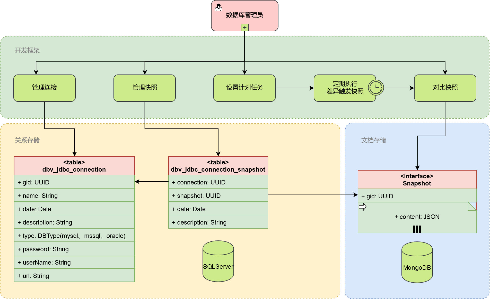
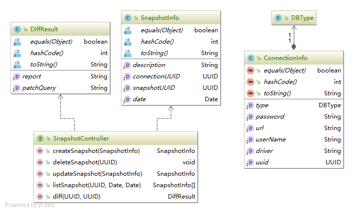
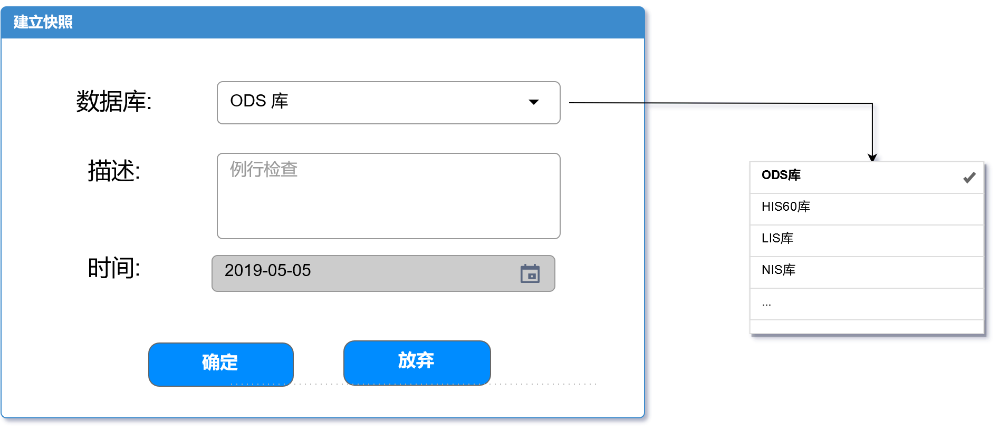
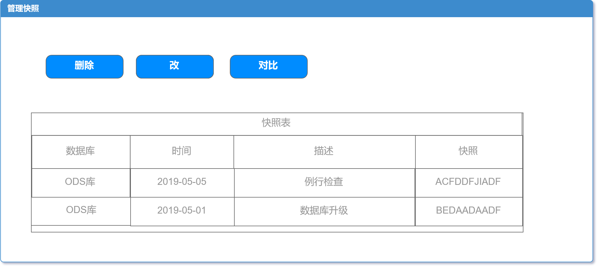
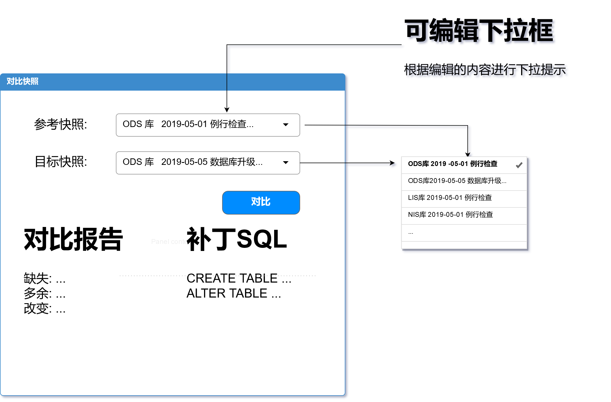

# 数据库版本化(DBV)

## 1. 概述

通过三个步骤管理数据库版本: 

1. 创建数据库连接
2. 对数据库连接的数据库做快照
3. 对两个快照做对比，发现数据库结构的变化并生成报告和SQL语句协助数据库管理员同步数据库结构

总体设计图:

## 2. 对象设计

- DBType: 数据库连接类型, 支持Oracle, MySQL, MSSQL
- ConnectionInfo: 数据库连接信息
- SnapshotInfo: 快照信息
- SnapshotController: 快照控制器
- DiffResult: 快照差异对比结果

## 3. 界面设计(示意图)

- 数据库连接管理界面, 由JEECG框架提供
- 快照生成界面
- 快照管理界面
- 快照对比及结果界面

